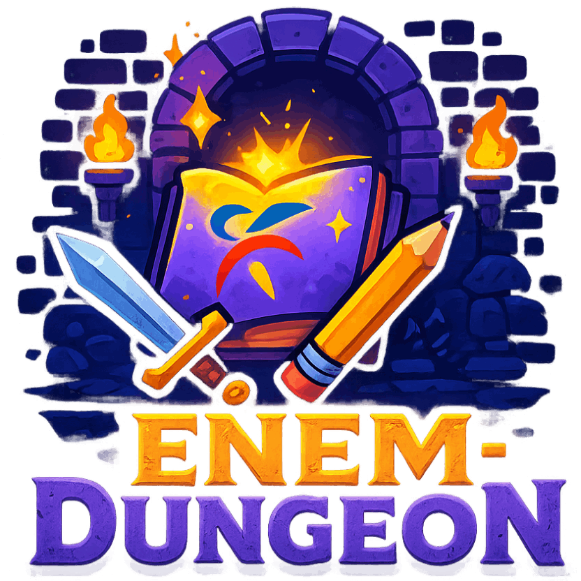

# 🛡️ ENEM Dungeon


> **Transformando a maratona do ENEM em uma jornada épica de RPG.**

<div align="center">
  
</div>

## ⚔️ Sobre o Projeto

O **ENEM Dungeon** é uma plataforma de *Game Learning* que utiliza a API pública do ENEM e Inteligência Artificial para transformar questões de prova em batalhas de RPG.

O objetivo não é apenas responder questões, mas "sobreviver" à masmorra do conhecimento. Cada questão é um monstro gerado proceduralmente, onde o acerto gera XP/Loot e o erro causa dano real ao avatar do jogador.

### 🌟 Destaques
- **Gamificação Real:** Sistema de HP, XP, Níveis e Inventário persistente.
- **AI Tutor (Em Breve):** Integração com **Ollama** para gerar explicações lúdicas e itens únicos baseados no desempenho.
- **Engenharia de Software:** Uso de *Design Patterns* (Adapter/Factory) para normalizar dados externos.
- **UX Imersiva:** Feedback visual e tátil com animações fluidas.

---

## 🛠️ Tech Stack & Decisões Arquiteturais

Este projeto foi construído simulando um ambiente de produção escalável.

- **Core:** [Next.js 14](https://nextjs.org/) (App Router) + TypeScript.
- **Estilização:** [Tailwind CSS](https://tailwindcss.com/) + [Shadcn/ui](https://ui.shadcn.com/) (para componentes acessíveis e consistentes).
- **State Management:** [Zustand](https://github.com/pmndrs/zustand) (escolhido pela simplicidade e performance superior ao Context API para estados de alta frequência como HP/XP).
- **Animações:** [Framer Motion](https://www.framer.com/motion/) (feedback de dano/acerto).
- **Data Fetching:** Integração com `enem-api` via Adapter Pattern.

### 📂 Estrutura de Pastas (Feature-First)
```text
src/
├── components/
│   ├── game/          # Componentes isolados da lógica do jogo (BattleCard, HUD)
│   └── ui/            # Componentes visuais reutilizáveis (Shadcn)
├── lib/
│   └── monster-factory.ts # Adapter que transforma JSON da API em Entidades de Jogo
├── store/
│   └── use-game-store.ts  # Store global (Zustand) para lógica de RPG
└── types/             # Contratos de dados (Interfaces TypeScript estritas)
🚀 Como Rodar Localmente
Pré-requisitos: Node.js 18+ instalado.

Clone o repositório

Bash

git clone [https://github.com/marcos-lima-dev/enem-dungeon.git](https://github.com/marcos-lima-dev/enem-dungeon.git)
cd enem-dungeon
Instale as dependências

Bash

npm install
Inicie o servidor de desenvolvimento

Bash

npm run dev
Acesse http://localhost:3000 e prepare-se para a batalha!

🗺️ Roadmap
[x] MVP: Loop principal de batalha (API -> Adapter -> Render).

[x] Engine: Sistema de Vida, XP e Level Up (Zustand).

[ ] UI: Cards de Batalha animados e HUD responsivo.

[ ] AI: Integração com Ollama para gerar "Loot" (Itens) após vitórias.

[ ] Progresso: Salvar estado do jogador no LocalStorage/Database.

[ ] Modo Boss: Questões complexas com mecânicas de tempo.

🤝 Contribuição
Este é um projeto Open Source para fins de estudo e portfólio. Sinta-se à vontade para abrir Issues ou Pull Requests.

👨‍💻 Autor
Desenvolvido por Marcos Lima Focado em Front-End Engineering, UX e React Ecosystem.
Linkedin: 